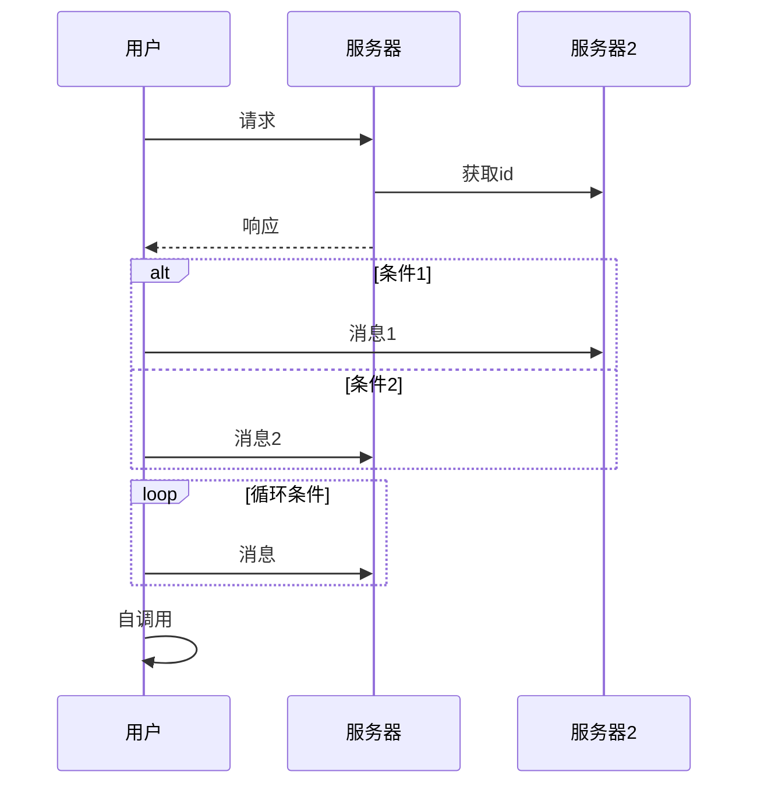
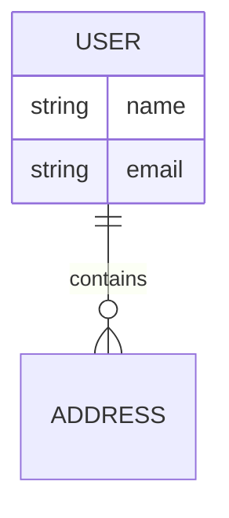
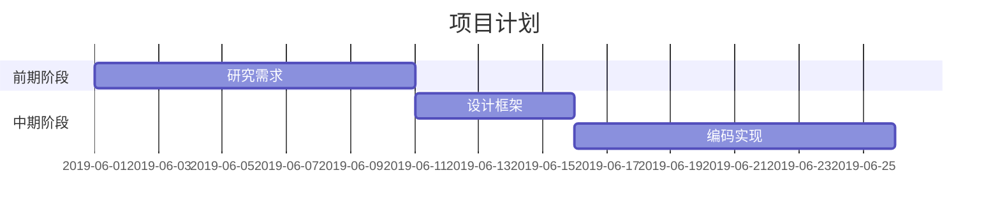
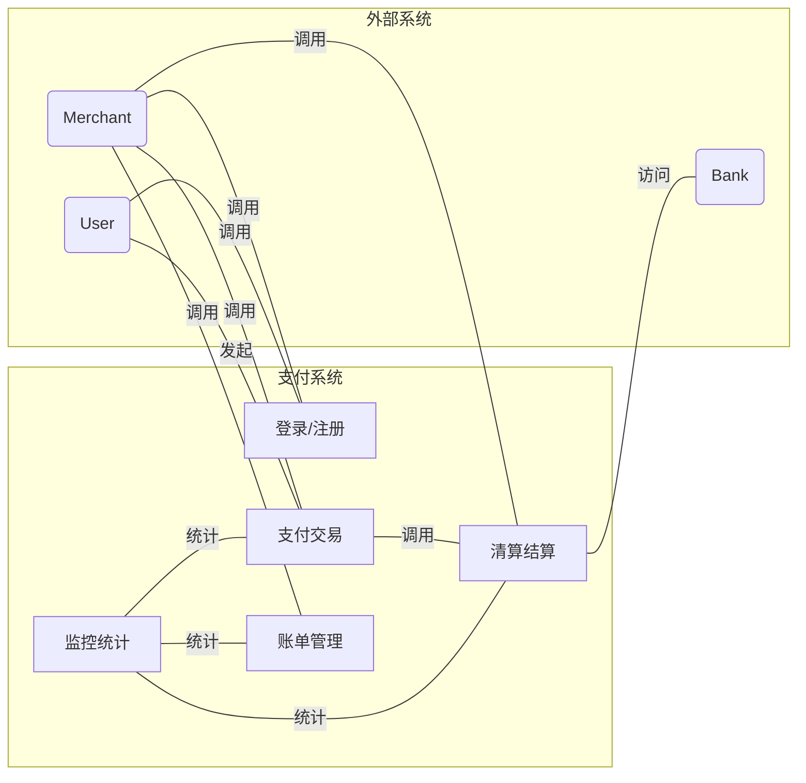

# 序列图

```mermaid
sequenceDiagram
用户->>服务器: 请求
服务器 ->> 服务器2: 获取id
服务器-->>用户: 响应
alt 条件1
    用户->>服务器2: 消息1
else 条件2
    用户->>服务器: 消息2
end
loop 循环条件
    用户->>服务器: 消息
end
用户 ->> 用户: 自调用
```

# ER图

```mermaid
erDiagram
    USER ||--o{ ADDRESS : contains
    USER {
        string name
        string email
    }
```

# 甘特图

```mermaid
gantt
title 项目计划
dateFormat YYYY-MM-DD
section 前期阶段
研究需求 :a1, 2019-06-01, 10d
section 中期阶段  
设计框架 :a2, after a1, 5d
编码实现 :a3, after a2, 10d
```

# 流程图

```mermaid
graph LR
subgraph 外部系统
用户(User)
商户(Merchant)
银行(Bank)
end

subgraph 支付系统
登录注册[登录/注册]
支付[支付交易]
清算[清算结算]
账单[账单管理]
监控[监控统计]
end

用户---|调用|登录注册
用户---|发起|支付
商户---|调用|登录注册
商户---|调用|支付
商户---|调用|清算
商户---|调用|账单 
监控---|统计|支付
监控---|统计|清算
监控---|统计|账单
支付---|调用|清算
清算---|访问|银行
```