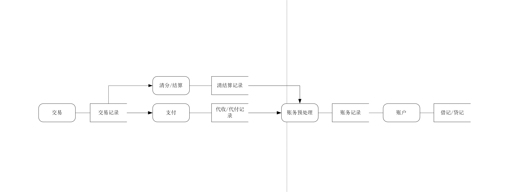
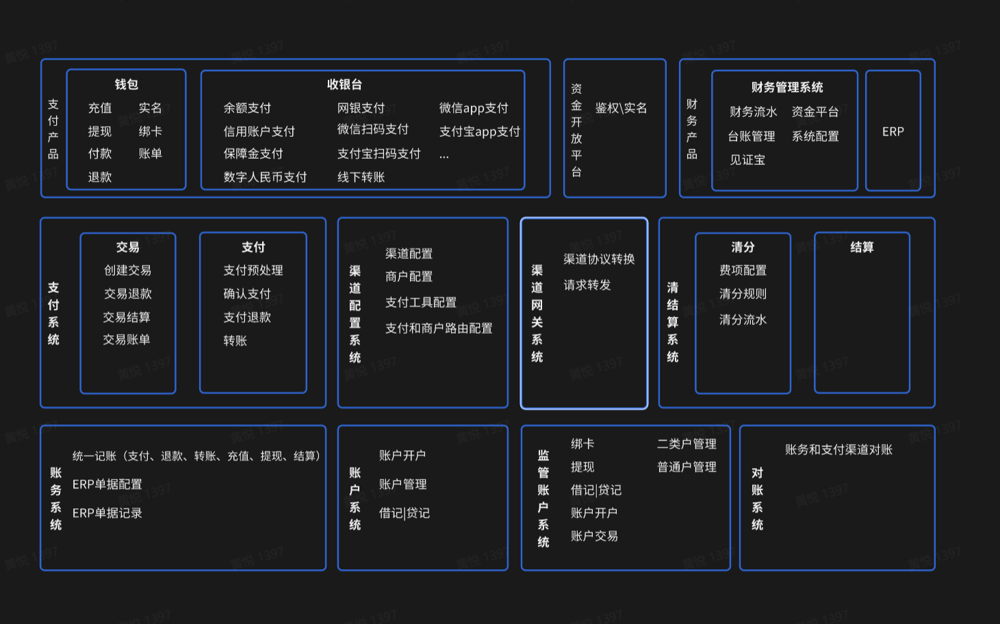

# 我所理解的支付体系

## 前言
我在做支付系统的整体架构之前，一直在思劳一个问题，我们的支付系统该怎么设计，怎么架构，它到底要解决什么问题。也看了网上很多讲支付体系的架构设计，大同小异，支付系统包括钱包、收银台、交易、支付、渠道网关、清分、结算、账户、对账等等。最近也看了下《会计基础》，通过这篇文章，可以和大家分享一下我的一些思考和感悟

## 支付体系要解决什么问题
支付体系是一个桥梁，他解决的问题就是把复杂的**业务描述**转化为相对标准化可进行财务核算的**会计描述**, 并最终完成债券和债务的转移,例如一个常见的交易场景 
- 1、用户微信支付订单100   =>  微信1133账户借记100，预收订单款账户贷记100
- 2、用户申请退款50       =>   微信1133账户贷记50，预收订单款账户借记50
- 3、用户结算给师傅50     =>   预收订单款账户借记50，平台收入账户贷记7.5，师傅钱包余额账户贷记42.5

业务描述偏向业务，变化较大，可以封装到交易模块，主要的能力就是直接和订单系统交互，记录原始的交易记录和交易状态。

## 支付体系整体架构

### 钱包

